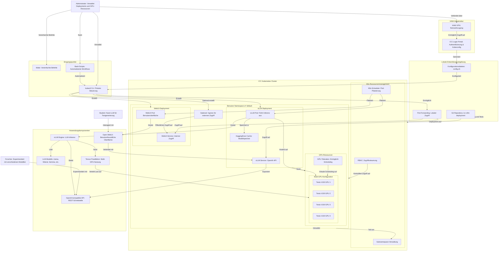

# ICC-vLLM-Deployment Architekturübersicht

Diese Dokumentation beschreibt die Architektur des ICC-vLLM-Deployment-Projekts, das die Bereitstellung von vLLM mit Multi-GPU-Unterstützung auf der Informatik Compute Cloud (ICC) der HAW Hamburg ermöglicht.

## Architekturdiagramm

## Hauptkomponenten

### 1. vLLM-Inferenzserver

vLLM (very Large Language Model) ist ein hochperformanter LLM-Inferenzserver mit folgenden Eigenschaften:

- **Hoher Durchsatz**: Verarbeitet mehrere Anfragen parallel dank PagedAttention-Technologie
- **Multi-GPU-Unterstützung**: Verteilt große Modelle über mehrere GPUs mittels Tensor-Parallelismus
- **OpenAI-kompatible API**: Implementiert die gleiche API wie OpenAI, was die Integration erleichtert
- **Modellkompatibilität**: Unterstützt eine Vielzahl von HuggingFace-Modellen
- **Quantisierung**: Unterstützt verschiedene Quantisierungsmethoden (AWQ, GPTQ) zur Reduzierung des Speicherbedarfs

vLLM wird als Kubernetes-Deployment bereitgestellt, das auf Nodes mit NVIDIA-GPUs orchestriert wird.

### 2. Open WebUI

Open WebUI ist eine benutzerfreundliche Frontend-Anwendung, die ursprünglich für Ollama entwickelt wurde, aber auch mit OpenAI-kompatiblen APIs arbeiten kann. Eigenschaften:

- **Chat-Interface**: Intuitive Benutzeroberfläche für die Interaktion mit LLMs
- **Konversationsspeicher**: Speichert Chatverläufe für zukünftige Referenz
- **Modellauswahl**: Unterstützt die Auswahl verschiedener Modelle (im Fall von vLLM ist dies meist nur ein Modell pro Deployment)
- **Parametersteuerung**: Erlaubt die Anpassung von Inferenzparametern wie Temperatur, Top-P usw.

Die WebUI wird als separates Kubernetes-Deployment bereitgestellt, das mit dem vLLM-Service kommuniziert.

### 3. Multi-GPU-Konfiguration

Die ICC stellt NVIDIA Tesla V100 GPUs bereit, die für die LLM-Inferenz optimiert sind:

- **Tensor-Parallelismus**: Verteilt die Tensor-Operationen eines Modells auf mehrere GPUs
- **GPU-Scheduling**: Die Kubernetes-Konfiguration sorgt dafür, dass die Pods auf Nodes mit der erforderlichen GPU-Anzahl platziert werden
- **Ressourcenlimits**: Die Deployments definieren präzise Ressourcenanforderungen für die GPUs

### 4. Kubernetes-Ressourcen

Das Deployment nutzt mehrere Kubernetes-Ressourcen:

- **Deployments**: Definieren die Container-Konfigurationen für vLLM und Open WebUI
- **Services**: Stellen interne Endpunkte für die Kommunikation zwischen den Komponenten bereit
- **PersistentVolumeClaims**: Optional für die persistente Speicherung von Modellen
- **ConfigMaps/Secrets**: Verwalten Konfigurationen und sensible Daten

## Kommunikations- und Datenfluss

1. **Modellladeprozess**:
   - vLLM lädt beim Start das konfigurierte Modell von HuggingFace oder aus dem lokalen Cache
   - Das Modell wird im GPU-Speicher gemäß der Tensor-Parallelismus-Konfiguration verteilt
   - Bei Multi-GPU-Setups werden die Modellgewichte auf mehrere GPUs verteilt

2. **Inferenzprozess**:
   - Die WebUI nimmt Benutzereingaben über das Chat-Interface entgegen
   - Die Anfrage wird über die OpenAI-kompatible API an den vLLM-Server gesendet
   - vLLM verarbeitet die Anfrage und nutzt dabei die konfigurierten GPUs
   - Die Antwort wird zurück an die WebUI gesendet und dem Benutzer präsentiert

3. **Administration**:
   - Administratoren verwenden die bereitgestellten Skripte, um das Deployment zu verwalten
   - Die Konfiguration kann über die `config.sh` angepasst werden
   - GPU-Ressourcen können dynamisch skaliert werden

## Sicherheit und Zugriffskontrolle

- **RBAC**: Kubernetes Role-Based Access Control regelt die Zugriffsrechte innerhalb des Clusters
- **NetworkPolicies**: Optional können Netzwerkrichtlinien den Traffic zwischen den Pods einschränken
- **Ingress**: Für externe Zugänglichkeit kann ein Ingress mit TLS-Termination konfiguriert werden

## Vorteile dieser Architektur

1. **Skalierbarkeit**: Durch die Nutzung von Kubernetes kann das System bei Bedarf horizontal und vertikal skaliert werden
2. **Flexibilität**: Die Modellauswahl kann dynamisch angepasst werden
3. **Performance**: Multi-GPU-Unterstützung und PagedAttention ermöglichen hohen Durchsatz und niedrige Latenz
4. **Isolierung**: Jeder Benutzer erhält eine isolierte Umgebung im eigenen Namespace
5. **Einfache Verwaltung**: Automatisierte Skripte vereinfachen die Verwaltung des Systems

## Einschränkungen und Herausforderungen

1. **GPU-Verfügbarkeit**: Die Anzahl verfügbarer GPUs in der ICC ist begrenzt
2. **Node-gebundener Tensor-Parallelismus**: vLLM unterstützt Tensor-Parallelismus derzeit nur innerhalb eines Knotens
3. **Speicherbeschränkungen**: Die V100 GPUs haben jeweils 16GB Speicher, was den Einsatz sehr großer Modelle ohne Quantisierung erschwert
4. **Zeit für Modellwechsel**: Das Laden neuer Modelle erfordert einen Neustart des vLLM-Pods und kann einige Zeit in Anspruch nehmen

## Deployment-Workflow

1. **Vorbereitung**: Einrichtung des ICC-Zugangs und Konfiguration des Namespaces
2. **Konfiguration**: Anpassung der Parameter in der `config.sh`
3. **Deployment**: Ausführung der Skripte zum Erstellen der Kubernetes-Ressourcen
4. **Validierung**: Überprüfung der Pod-Logs und Sicherstellen, dass das Modell geladen wurde
5. **Zugriff**: Port-Forwarding oder Ingress-Konfiguration für den Zugriff auf die WebUI
6. **Nutzung**: Interaktion mit dem LLM über die WebUI oder direkt über die API
7. **Wartung**: Überwachung der GPU-Auslastung und gegebenenfalls Skalierung der Ressourcen

Diese Architektur bietet eine flexible, skalierbare und benutzerfreundliche Lösung für den Einsatz von Large Language Models in der akademischen Umgebung der HAW Hamburg.